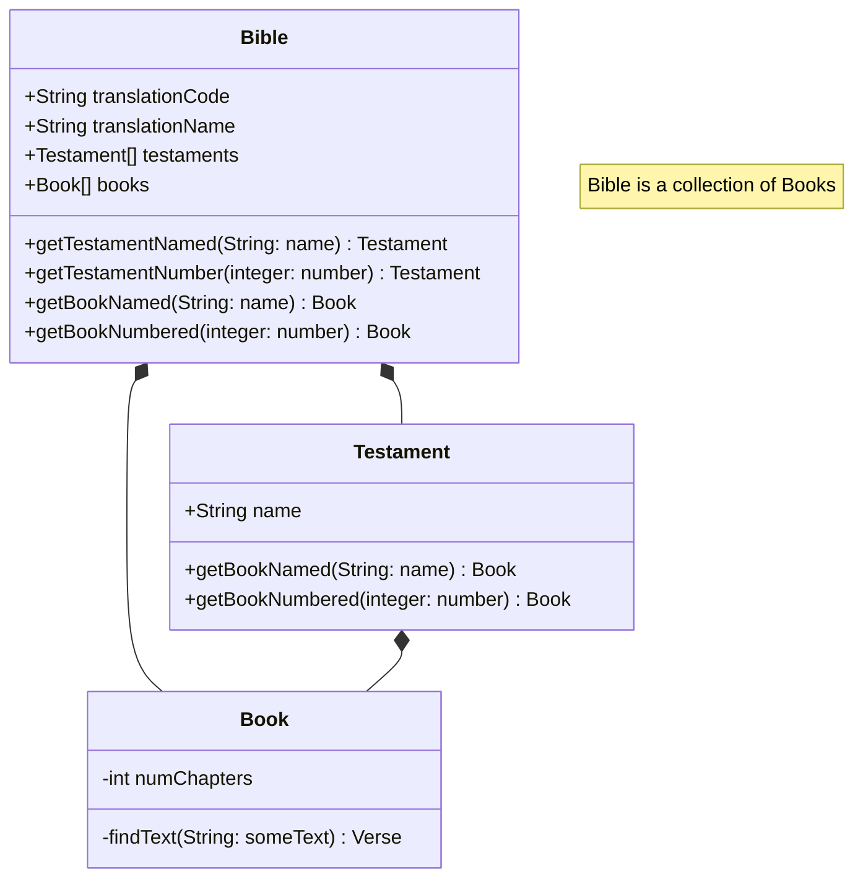

# DataModel.md
This file describes the object model that manages the raw data from the original SQL database 
and provides and manages that data at runtime.  

## Basics of object modeling using the UML language and CRC Cards.
See my page on [Software Design](https://michaelkentburns.com/index.php/software-design/) for a discussion of design principles, UML, and CRC Cards.
I will now present a basic CRC card design for this project.

## UML model for the BibleModel project

### Package: BibleModel 

#### Class: DataSource.js

#### Class: Location.js

#### Class Xref.js 