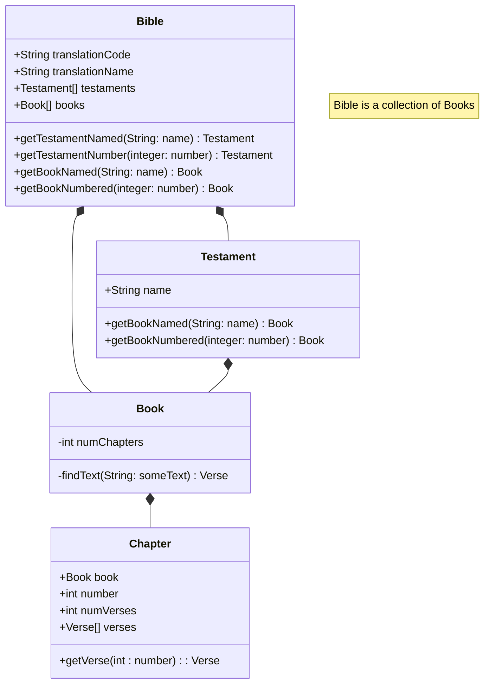

# DataModel.md
This file describes the object model that manages the raw data from the original SQL database 
and provides and manages that data at runtime.  

## Basics of object modeling using the UML language and CRC Cards.
See my page on [Software Design](https://michaelkentburns.com/index.php/software-design/) for a discussion of design principles, UML, and CRC Cards.
I will now present a basic CRC card design for this project.

## UML model for the BibleModel project

### Package: BibleModel 


#### Class: DataSource.js


#### Class: Location.js

#### Class Xref.js 

#### Class TestUML
[<a href="https://mermaid.js.org/syntax/classDiagram.html">docs</a> - <a href="https://mermaid.live/edit#pako:eNpdkTFPwzAQhf-K5QlQ2zQJJG1UBaGWDYmBgYEwXO1LYuTEwXYqlZL_jt02asXm--690zvfgTLFkWaUSTBmI6DS0BTt2lfzkKx-p1PytEO9f1FtdaQkI2ulZNGuVqK1qEtgmOfk7BitSzKdOhg59XuNGgk0RDxed-_IOr6uf8cZ6UhTZ8bvHqS5ub1mr9svZPbjk6DEBlu7AQuXyBkx4gcvDk9cUMJq0XT_YaW0kNK5j-ufAoRzcihaQvLcoN4Jv50vvVxw_xrnD3RCG9QNCO4-8OgpqK1dpoJm7smxhF7agp6kfcfB4jMXVmmalW4tnFDorXrbt4xmVvc4is53GKFUwNF5DtTuO3-sShjrJjLVlqLyvNfS4drazmRB4NuzSti6386YagIjeA3a1rtlEiRRsoAoxiSN4SGOOduGy0UZ3YclT-dhBHQYhj8dc6_I">live editor</a>]

```
---
title: Animal example
---
classDiagram
    note "From Duck till Zebra"
    Animal <|-- Duck
    note for Duck "can fly\ncan swim\ncan dive\ncan help in debugging"
    Animal <|-- Fish
    Animal <|-- Zebra
    Animal : +int age
    Animal : +String gender
    Animal: +isMammal()
    Animal: +mate()
    class Duck{
        +String beakColor
        +swim()
        +quack()
    }
    class Fish{
        -int sizeInFeet
        -canEat()
    }
    class Zebra{
        +bool is_wild
        +run()
    }
```

---
title: Bank example
---
classDiagram
    class BankAccount
    BankAccount : +String owner
    BankAccount : +Bigdecimal balance
    BankAccount : +deposit(amount)
    BankAccount : +withdrawal(amount)

