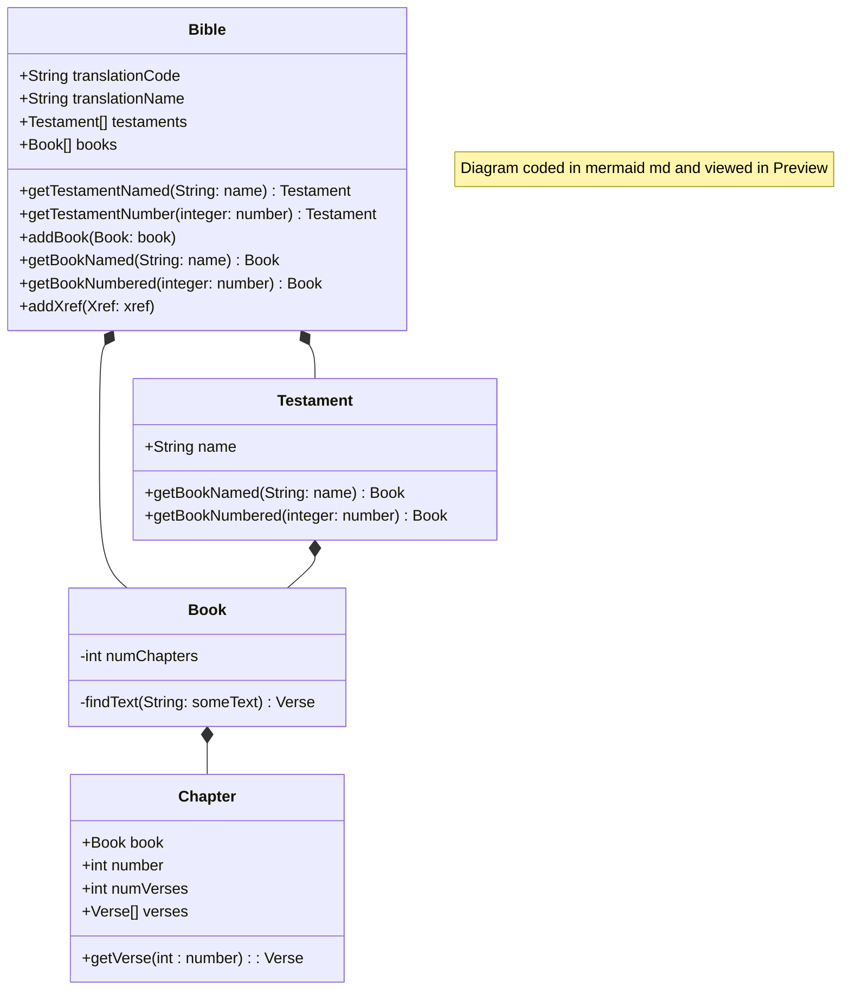

# ObjectModel.md
This file describes the object model that manages the raw data from the original SQL database and provides and manages that data at runtime.  

## Basics of object modeling using the UML language and CRC Cards.
See my page on [Software Design](https://michaelkentburns.com/index.php/software-design/) for a discussion of design principles, UML, and CRC Cards.

The CRC Cards in textual form are in a comment block at the top of each of the .js files. 

## UML model for the BibleModel project

### Package: BibleModel 


#### Class: DataSource.js
#### Class: Location.js
#### Class Xref.js 

[<a href="https://mermaid.js.org/syntax/classDiagram.html">docs</a> - <a href="https://mermaid.live/edit#pako:eNpdkTFPwzAQhf-K5QlQ2zQJJG1UBaGWDYmBgYEwXO1LYuTEwXYqlZL_jt02asXm--690zvfgTLFkWaUSTBmI6DS0BTt2lfzkKx-p1PytEO9f1FtdaQkI2ulZNGuVqK1qEtgmOfk7BitSzKdOhg59XuNGgk0RDxed-_IOr6uf8cZ6UhTZ8bvHqS5ub1mr9svZPbjk6DEBlu7AQuXyBkx4gcvDk9cUMJq0XT_YaW0kNK5j-ufAoRzcihaQvLcoN4Jv50vvVxw_xrnD3RCG9QNCO4-8OgpqK1dpoJm7smxhF7agp6kfcfB4jMXVmmalW4tnFDorXrbt4xmVvc4is53GKFUwNF5DtTuO3-sShjrJjLVlqLyvNfS4drazmRB4NuzSti6386YagIjeA3a1rtlEiRRsoAoxiSN4SGOOduGy0UZ3YclT-dhBHQYhj8dc6_I">live editor</a>]

```