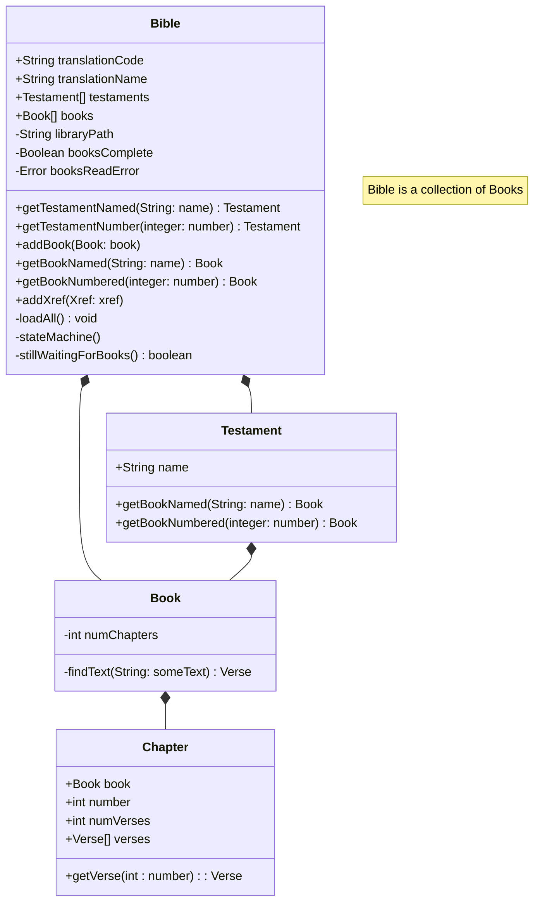

# ObjectModel.md
This file describes the object model that manages the raw data from the original SQL database and provides and manages that data at runtime.  

## Basics of object modeling using the UML language and CRC Cards.
See my page on [Software Design](https://michaelkentburns.com/index.php/software-design/) for a discussion of design principles, UML, and CRC Cards.
I will now present a basic CRC card design for this project.

## NOTE: Diagrams in this document are written for <a href="https://mermaid.js.org/">Mermaid markup</a>.

GitHub should show the markup in "Code" tab, but a nice diagram in "Preview" tab.
If the program you are viewing this in is NOT showing a diagram, then you should find a link below 
the markup labeled "Open Mermaid Live editor".   Copy the markup into your clipboard, then click on the link.
You should see a side by side editor pre-populated with a sample.   Replace that with the markup from this
page and you should see the diagram magically appear on the right.   

Here are some more docs about Mermaid:  [<a href="https://mermaid.js.org/syntax/classDiagram.html">Mermaid docs</a>]

## UML model for the BibleModel project

### Package: BibleModel 

[<a href="https://mermaid.live/edit#pako:eNpdkTFPwzAQhf-K5QlQ2zQJJG1UBaGWDYmBgYEwXO1LYuTEwXYqlZL_jt02asXm--690zvfgTLFkWaUSTBmI6DS0BTt2lfzkKx-p1PytEO9f1FtdaQkI2ulZNGuVqK1qEtgmOfk7BitSzKdOhg59XuNGgk0RDxed-_IOr6uf8cZ6UhTZ8bvHqS5ub1mr9svZPbjk6DEBlu7AQuXyBkx4gcvDk9cUMJq0XT_YaW0kNK5j-ufAoRzcihaQvLcoN4Jv50vvVxw_xrnD3RCG9QNCO4-8OgpqK1dpoJm7smxhF7agp6kfcfB4jMXVmmalW4tnFDorXrbt4xmVvc4is53GKFUwNF5DtTuO3-sShjrJjLVlqLyvNfS4drazmRB4NuzSti6386YagIjeA3a1rtlEiRRsoAoxiSN4SGOOduGy0UZ3YclT-dhBHQYhj8dc6_I">Open Mermaid Live editor</a>]

#### Class: DataSource.mjs
#### Class: Location.mjs
#### Class Xref.mjs 

#### Class TestUML
