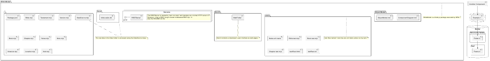

# Michael's notes on using PlantUML to do diagrams.

## PlantUML is a markdown based diagramming package.
See the [PlantUML page here](https://plantuml.com)

There are [syntax guides for various diagrem types]()

There is a [visual editor for PlantUML](https://editor.plantuml.com/)


## Component diagram for the BibleModel project. 



### The PlantUML syntax that created that component diagram follows:

```
@startuml

package "BibleModel" {
    folder "." {
        
    [Package.json]
    [Bible.mjs]
    [Testament.mjs]
    [Version.mjs]
    [Book.mjs]
    [Chapter.mjs]
    [Verse.mjs]
    [Note.mjs]
    [NoteList.mjs]
    [Location.mjs]
    [Xref.mjs]
    [DataSource.mjs]

    }
    folder "Data" {
       [bible-sqlite.db]
    }  
    note as m4
       The raw data in the Data folder is accessed using the DataSource class.
    end note
    Data .. m4
    DataSource.mjs .. m4
  [Servers]
  [DevUI]
  folder "DevUI" { 
      [WebFolder]

   note as n3
      DevUI contains a developer's user interface as web pages.
    end note
    WebFolder .. n3
    }


  folder "tests" {
    [Node-unit-tests] 
    [Bible.test.mjs]
    [Book.test.mjs]
    [Chapter.test.mjs]
    
    [testRest.html]
    [testRest.sh]
  note as n2
    test files named *-test.mjs are unit tests suites run by npm.
  end note
  tests .. n2
  }


  folder "ObjectModel" {
    [ObjectModel.md]
    [ComponentDiagram.md]
  }
note as n1
   BibleModel is a Node.js package executed by NPM.
end note
BibleModel .. n1
}

node "Servers" {
  HTTP - [RESTServer]
  note as n5
     The RESTServer is started by 'npm run main' and operates as a normal HTTP server.\n
     However, it has a REST plugin named middlewareREST.mjs.  \n
     See the README.md file.
  end note
}

cloud {
  [Example 1]
}


database "MySql" {
  folder "This is my folder" {
    [Folder 3]
  }
  frame "Foo" {
    [Frame 4]
  }
}


[Another Component] --> [Example 1]
[Example 1] --> [Folder 3]
[Folder 3] --> [Frame 4]

@enduml
```


@startuml

[First component]
[Another component] as Comp2
component Comp3
component [Last\ncomponent] as Comp4

@enduml

@startuml
component [$C1]
component [$C2] $C2
component [$C2] as dollarC2

@enduml

@startuml
component [$C1]
component [$C2] $C2
component [$C2] as dollarC2
remove $C1
remove $C2
remove dollarC2
@enduml