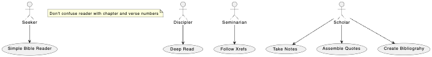

# This is my first test of PlantUML
See instructions https://pdf.plantuml.net/1.2021.1/PlantUML_Language_Reference_Guide_en.pdf

## Simple Bible Reader
 
 Seeker: A first time reader wants to simply read the Gospel of Mark without distractions.
 
 Discipler: A discipler needs to read deeply and leave bookmarks so that he can answer difficult quesions posed by her disciple.

 Seminarian: A seminary student needs to follow cross references in order to understand context and relate quotations to their original writing. 

Scholar: An advanced seminarian preparing a paper needs to take notes associated with verses or passages and follow cross references and comment on their relationship.  When preparing his paper he needs to compose his paper and have the program insert proper quotations and verse references into his paper. 

